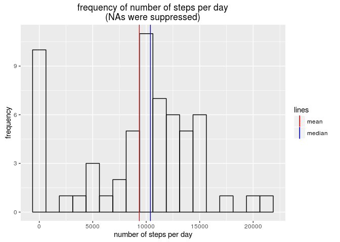
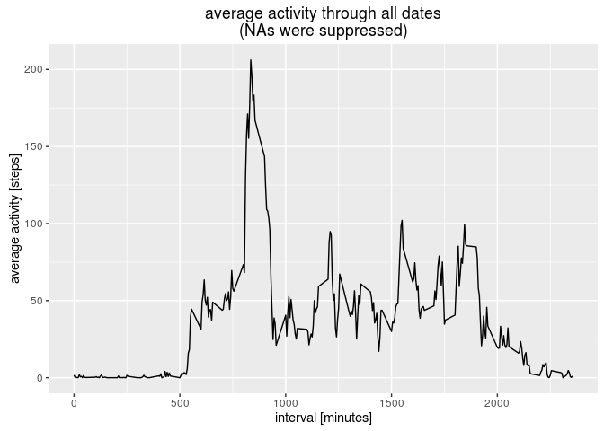
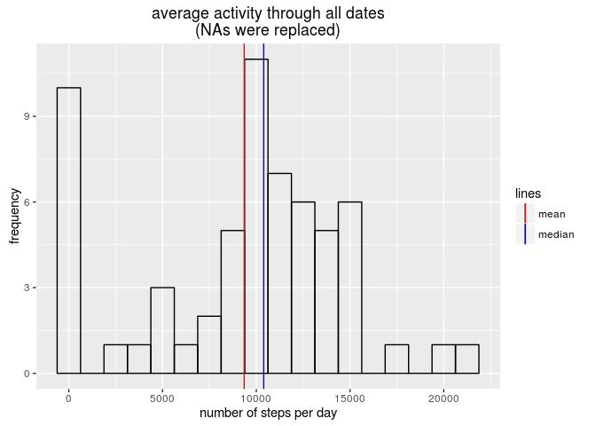
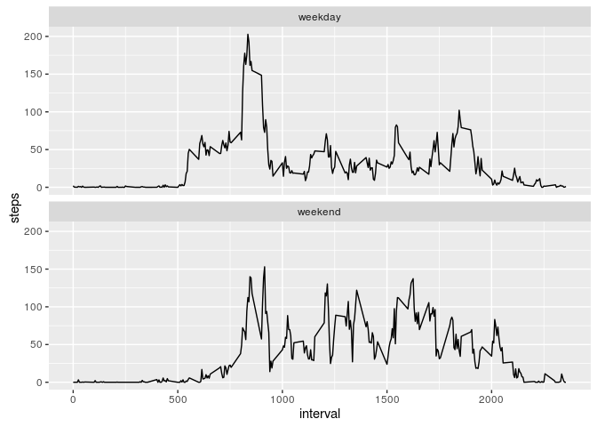

# Reproducible Research: Peer Assessment 1
Rogelio Caballero  


The follwowing are my annotated answers to the 1st peer-reviewed assignment of Reproducible Research course, Johns Hopkins University on Coursera.

The assignment is about processing data from wearable devices.

## Imports
For this assignment we will require the package *dplyr* because of its efficiency for working with large datasets, the package *ggplot2* for its beautiful plots and intuitive coding and the package *chron* for a specific functionality that will be explained later.


```r
library(ggplot2)
library(dplyr)
library(chron)
```

The imported data set will be stored in a dataframe variable called *wearbl_data*

```r
setwd("/home/rogelio/Desktop/datasciencecoursera/RepData_PeerAssessment1")

wearbl_data <- read.csv("./activity.csv")

head(wearbl_data)
```

```
##   steps       date interval
## 1    NA 2012-10-01        0
## 2    NA 2012-10-01        5
## 3    NA 2012-10-01       10
## 4    NA 2012-10-01       15
## 5    NA 2012-10-01       20
## 6    NA 2012-10-01       25
```

Entries of column *wearbl_data$date* are factor. To put everything in a standarized format, it is convenient to *mutate* that column to *Date* class.


```r
wearbl_data <- mutate(wearbl_data, date = as.Date(date))
```

## What is mean total number of steps taken per day?
To answer this question we will first collapse *wearbl_data* by interval. The resulting dataset *num_o_steps* will contain days vs. number of steps.


```r
num_o_steps <- aggregate(wearbl_data$steps, 
                         list(wearbl_data$date), 
                         function(x){sum(x, na.rm = TRUE)})

names(num_o_steps) <- c("date", "number_of_steps")

head(num_o_steps)
```

```
##         date number_of_steps
## 1 2012-10-01               0
## 2 2012-10-02             126
## 3 2012-10-03           11352
## 4 2012-10-04           12116
## 5 2012-10-05           13294
## 6 2012-10-06           15420
```
Observe that the function that collapses *wearbl_data* suppresses the NAs.
The following histogram represents the frequency of each number of steps along with its mean and median.

```r
p <- ggplot(num_o_steps, aes(number_of_steps)) + 
        geom_histogram(color = "black", fill = NA, binwidth = 1250) + 
        geom_vline(aes(colour = "median", 
                       xintercept = median(num_o_steps$number_of_steps))) + 
        geom_vline(aes(colour = "mean", 
                       xintercept = mean(num_o_steps$number_of_steps))) + 
        scale_colour_manual("lines", values = c(median = "blue",mean = "red")) +
        labs(x = "number of steps per day", y = "frequency") +
        labs(title = "frequency of number of steps per day\n(NAs were suppressed)")

print(p)
```

<!-- -->

The following table shows the exact values of the mean and the median of the number of steps per day.

```r
tab <- data.frame(mean = mean(num_o_steps$number_of_steps), 
                  median = median(num_o_steps$number_of_steps))

library(xtable)
xt <- xtable(tab)
print(xt, type = "html", include.rownames = FALSE)
```

<!-- html table generated in R 3.3.2 by xtable 1.8-2 package -->
<!-- Sun Nov 20 02:30:00 2016 -->
<table border=1>
<tr> <th> mean </th> <th> median </th>  </tr>
  <tr> <td align="right"> 9354.23 </td> <td align="right"> 10395 </td> </tr>
   </table>

## What is the average daily activity pattern?
First, we will collapse *wearbl_data* by date. The resulting data frame, *av_in_interval*, will contain for each 5 minute interval the average number of steps taken during all the dates of the analysis.


```r
av_in_interval <- aggregate(wearbl_data$steps, list(wearbl_data$interval), 
                         function(x){mean(x, na.rm = TRUE)})

names(av_in_interval) <- c("interval", "average_activity")

head(av_in_interval)
```

```
##   interval average_activity
## 1        0        1.7169811
## 2        5        0.3396226
## 3       10        0.1320755
## 4       15        0.1509434
## 5       20        0.0754717
## 6       25        2.0943396
```

Again, observe that NAs are being suppressed by the function that collapses *wearbl_data*.

We produced a time series of average activity (in steps) during all intervals in one day.

```r
ggplot(av_in_interval, aes(av_in_interval$interval, 
                           av_in_interval$average_activity)) +
        geom_line() + 
        labs(x = "interval [minutes]", y = "average activity [steps]") +
        labs(title = "average activity through all dates\n(NAs were suppressed)")
```

<!-- -->

The following code gives the interval for which activity is the highest.

```r
a <- which(av_in_interval$average_activity == max(av_in_interval$average_activity))
av_in_interval$interval[a]
```

```
## [1] 835
```
## Imputing missing values
The dataset *wearbl_data* has NAs. This will give us the number of NAs in column *steps*:

```r
sum(is.na(wearbl_data$steps))
```

```
## [1] 2304
```
Incomplete cases are no more than the number of NAs in column steps:

```r
sum(complete.cases(wearbl_data)) == sum(!is.na(wearbl_data$steps))
```

```
## [1] TRUE
```
That means we can focus on looking for NAs of that particular column only.
In this section, we will replace in each day the NAs of *wearbl_data* with the mean number of steps for that day.
First, we will create a copy of *wearbl_data* to work on:

```r
wearbl_data1 <- wearbl_data
```

The following will create a vector of the mean number of steps for each day.

```r
means_by_date <- aggregate(wearbl_data1$steps, list(wearbl_data1$date), 
           function(x){mean(x, na.rm = TRUE)})$x

sum(is.nan(means_by_date))
```

```
## [1] 8
```
The goal with that vector is to replicate each component a number of times equal to the number of intervals in each day. However, as we can see there are elements of *means_by_date* that are NANs. That happens even after removing NAs when taking the mean because there are days in which all the values of steps are NAs.
It is not convenient to have those NANs if we want to use *means_by_date* to replace NAs. The following chunk will take care of that by replacing NANs with 0s.

```r
means_by_date[is.nan(means_by_date)] <- 0
```
Here, we will replicate the values stored in *means_by_date* to match the length of *wearbl_data1*.

```r
means_by_date <- rep(means_by_date, each = 288)
```
And, finally, we replace the NAs of *wearbl_data1*:

```r
# a logical vector that contains the positions of NAs
# in wearbl_data$steps
pos_nas <- is.na(wearbl_data1$steps)

wearbl_data1$steps[pos_nas] <- means_by_date[pos_nas]
```
The following histogram of the daily number of steps includes the replacements of NAs:

```r
num_o_steps1 <- aggregate(wearbl_data1$steps, list(wearbl_data1$date), 
                         function(x){sum(x, na.rm = TRUE)})

p <- ggplot(num_o_steps1, aes(x)) + 
        geom_histogram(color = "black", fill = NA, binwidth = 1250) + 
        geom_vline(aes(colour = "median", xintercept = median(num_o_steps1$x))) + 
        geom_vline(aes(colour = "mean", xintercept = mean(num_o_steps1$x))) + 
        scale_colour_manual("lines", values = c(median = "blue",mean = "red")) +
        labs(x = "number of steps per day", y = "frequency") +
        labs(title = "average activity through all dates\n(NAs were replaced)")

print(p)
```

<!-- -->
There is no observable difference between suppressing the NAs or replacing them by the mean. That happens because the NAs are few enough not to shift each total number of steps to another bin of the histogram.
Let us take a closer look. The following table shows the mean and median of the number of steps with and without replacing NAs:

```r
tab1 <- data.frame(method = c("NAs replaced", "NAs suppressed"), 
                   mean = c(mean(num_o_steps1$x), 
                            mean(num_o_steps$number_of_steps)), 
                  median = c(median(num_o_steps1$x), 
                             median(num_o_steps$number_of_steps)))

xt <- xtable(tab1)
print(xt, type = "html", include.rownames = FALSE)
```

<!-- html table generated in R 3.3.2 by xtable 1.8-2 package -->
<!-- Sun Nov 20 02:30:01 2016 -->
<table border=1>
<tr> <th> method </th> <th> mean </th> <th> median </th>  </tr>
  <tr> <td> NAs replaced </td> <td align="right"> 9354.23 </td> <td align="right"> 10395.00 </td> </tr>
  <tr> <td> NAs suppressed </td> <td align="right"> 9354.23 </td> <td align="right"> 10395.00 </td> </tr>
   </table>
As we can see there are no differences in the mean and median when replacing the NAs.
## Are there differences in activity patterns between weekdays and weekends?
First, we are going to add an extra column *is_it_weekday* to *wearbl_data1* that indicates whether a particular date is a weekday or not.

```r
wkday <- wearbl_data1$date

is_it_weekday <- vector(length = length(wkday))

is_it_weekday[is.weekend(wkday)] <- "weekend"
is_it_weekday[!is.weekend(wkday)] <- "weekday"

wearbl_data1 <- cbind(wearbl_data1, is_it_weekday)

head(wearbl_data1)
```

```
##   steps       date interval is_it_weekday
## 1     0 2012-10-01        0       weekday
## 2     0 2012-10-01        5       weekday
## 3     0 2012-10-01       10       weekday
## 4     0 2012-10-01       15       weekday
## 5     0 2012-10-01       20       weekday
## 6     0 2012-10-01       25       weekday
```
Now, we will create two time series plots to see if there are differences in activity patterns between weekdays and weekends. We'll start by collapsing *wearbl_data1* by taking the mean in each interval for all days and for the different kinds of day (weekend or weekday):

```r
av_in_interval1 <- aggregate(steps ~ interval + is_it_weekday,
                            data = wearbl_data1,
                            function(x){mean(x, na.rm = TRUE)})
```
The following are the time series of weekends and weekdays:

```r
ggplot(av_in_interval1, aes(interval, steps)) +
        geom_line() + 
        facet_wrap(~is_it_weekday, ncol = 1)
```

<!-- -->

As we can see activity is more evenly distributed during weekends. Weekdays have a prominent peak around interval 900. 
